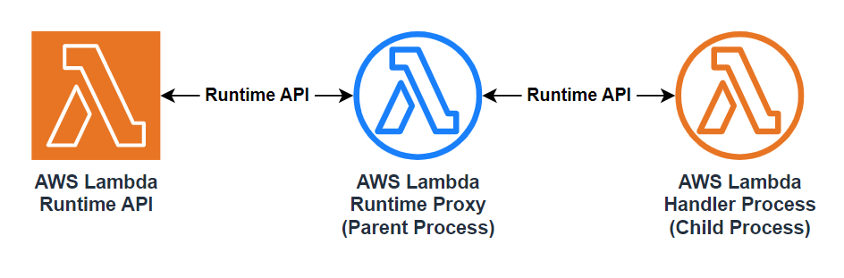
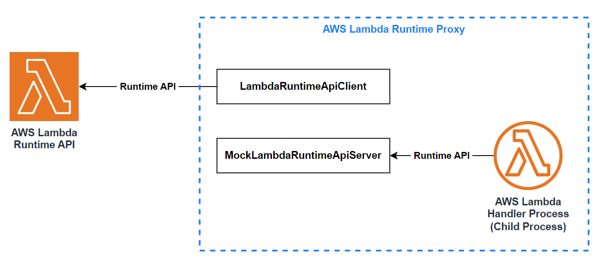

# AWS Lambda Runtime Proxy

[](https://crates.io/crates/aws-lambda-runtime-proxy)




A helper lib to customize the communication between the lambda handler process and the lambda runtime api.

## Usage

### Installation

Add the following to the `dependencies` in your `Cargo.toml`:

```toml
aws-lambda-runtime-proxy = "0.2"
```

or run:

```bash
cargo add aws-lambda-runtime-proxy
```

### [Examples](./examples)

A real world case: [AWS Lambda Log Proxy](https://github.com/DiscreteTom/aws-lambda-log-proxy).

### [Documentation](https://docs.rs/aws-lambda-runtime-proxy/)

## FAQ

### What's the Purpose of this Project?

- Override [reserved environment variables](https://docs.aws.amazon.com/lambda/latest/dg/configuration-envvars.html#configuration-envvars-runtime) like `AWS_LAMBDA_RUNTIME_API`.
- Capture or modify the output of the handler function, including the stdout, stderr, or the return value.
- Add additional command line arguments to the handler process.

### How Does This Work?



This library will do the following:

- Start an HTTP server to act as the fake AWS Lambda runtime API server, accepting requests from the handler process.
- Spawn the handler process as a child process, with the environment variables modified to point to the fake AWS Lambda runtime API server.
- (Optional) Forward requests from the handler process to the real AWS Lambda runtime API server.

Based on this setup, you can write your own logic to process the requests and responses between the handler process and the AWS Lambda runtime API.

### Performance

See [benchmark](./benchmark/README.md). TLDR: the proxy will introduce less than 2ms latency, which is acceptable for most use cases.

## [CHANGELOG](./CHANGELOG.md)
